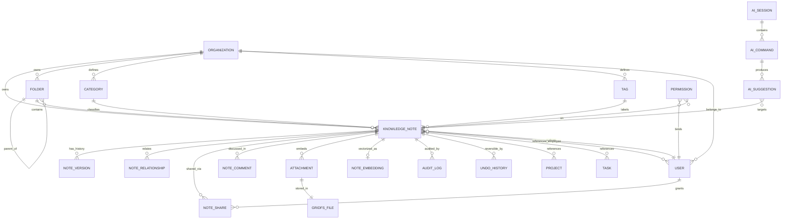

# Knowledge Vault — MongoDB Architecture & Upgrade Design

> **Status:** Design blueprint (v1). Non-destructive — nothing here changes your
> running `Note.js` / `notes.js` until you choose to implement a phase.
> **Author context:** Produced against the live `backend-taskManager` codebase
> (Node + Express + Mongoose). Framework-neutral where the request asked for it;
> concrete Mongoose where you asked for real models.

---

## 0. Read this first — the premise correction

Two facts change the whole shape of this project:

1. **You are already on MongoDB.** `src/models/Note.js` is a Mongoose model on
   the `notes` collection; `/api/notes` already reads/writes it. This is **not** a
   relational→NoSQL migration. It is an **in-place schema evolution + additive
   collections** on the database you already run. That means we get **zero
   downtime** and **full backward compatibility** for free — we extend a
   collection, we don't move data between engines.

2. **S3 is decommissioned.** All binary/unstructured media (images, files, video,
   voice notes) will live in **GridFS** (MongoDB's native chunked file store),
   with your existing local-disk `saveToServer` pattern as a pluggable fallback.
   No note logic ever references a storage provider directly — it goes through a
   `StorageService` interface (§7).

Everything below is designed around those two facts.

### What stays untouched (your hard requirements)
| Requirement | How it's honored |
|---|---|
| Existing functionality works | New fields are **optional with defaults**; old docs read/write unchanged |
| Auth unchanged | Keeps `requireAuth` + JWT `req.user.sub/role`; no token changes |
| Users unchanged | Reuses `User`/`Employee` collections; note `ownerId` = current `userId` |
| Permissions unchanged | RBAC layers **on top of** current role checks, never replaces them |
| APIs unchanged where possible | `/api/notes` v1 contract frozen; new power lives under `/api/knowledge/*` (§9) |
| UI unchanged unless required | v1 responses keep every current field; UI opts into new fields when ready |
| MongoDB introduced gradually | Strangler-fig / expand–migrate–contract rollout (§11) |

---

## Table of Contents
1. [Compatibility contract](#1-compatibility-contract)
2. [Layered architecture](#2-layered-architecture)
3. [ER diagram](#3-er-diagram--collection-relationships)
4. [Collection catalog](#4-collection-catalog)
5. [Knowledge Note schema (full)](#5-knowledge-note-schema-full-mongoose)
6. [Supporting collection schemas](#6-supporting-collection-schemas)
7. [Storage architecture (no S3 → GridFS)](#7-storage-architecture-no-s3--gridfs)
8. [Index strategy](#8-index-strategy)
9. [API structure & endpoints](#9-api-structure--endpoints)
10. [Folder structure & code layers](#10-folder-structure--code-layers)
11. [Migration strategy](#11-migration-strategy)
12. [AI integration architecture](#12-ai-integration-architecture)
13. [Search architecture](#13-search-architecture-text--vector)
14. [Security architecture](#14-security-architecture)
15. [Performance optimization](#15-performance-optimization)
16. [Backup strategy](#16-backup-strategy)
17. [Scaling strategy](#17-scaling-strategy)
18. [Best practices](#18-best-practices)
19. [Vector database — future](#19-vector-database--future)
20. [Implementation roadmap](#20-implementation-roadmap)

---

## 1. Compatibility contract

The single rule that makes this safe: **additive, never subtractive.**

- Every new field on `notes` is **optional** and has a **default**, so:
  - existing documents remain valid (no backfill required to keep working),
  - the existing POST/PATCH bodies still validate,
  - the existing GET response still contains `id, userId, title, content, color, isPinned, isFavorite, folder, tags, actionItems, notesList, attachments, lastOpenedAt, createdAt, updatedAt`.
- The current `/api/notes` handlers keep working **verbatim**. New behavior is
  exposed through a **new versioned surface** `/api/knowledge/v2/*` (§9). When the
  UI is ready, it migrates endpoint-by-endpoint. The old surface can be retired
  later (the "contract" phase of §11) — or kept forever as a thin adapter.
- Field **renames are done by aliasing**, not replacement. Example: `owner` is a
  virtual/alias over the existing `userId`; `folder` (string) coexists with
  `folderId` (ObjectId) until the UI is migrated.

---

## 2. Layered architecture

Today `notes.js` calls Mongoose directly inside route handlers. That's fine for a
CRUD note, but the Knowledge Vault (AI, versioning, sharing, audit, search) needs
seams. We introduce a clean layering — **the same repository pattern you already
use in `src/repositories/wipRepository.js`**, just applied consistently.

```
HTTP → Router → Controller → Service → Repository → Mongoose Model → MongoDB
                   │            │           │
                  DTO      business     query/agg
               validation    rules      isolation
```

| Layer | Responsibility | Never does |
|---|---|---|
| **Controller** | Parse/validate DTO, map to service call, shape HTTP response | Business logic, DB queries |
| **Service** | Business rules, orchestration, transactions, events, AI calls | Build raw Mongo queries |
| **Repository** | All Mongoose/aggregation, org-scoping, soft-delete filter | HTTP concerns, business rules |
| **Model** | Schema, validation, indexes, hooks | Cross-collection logic |

Benefits: AI/search/versioning become **injectable services**; org-isolation and
soft-delete filters live in **one place** (the repository base class) so they can
never be forgotten in an ad-hoc handler.

---

## 3. ER diagram & collection relationships



**Reference philosophy:** normalize with `ObjectId` refs for entities that live on
their own and change independently (Folder, Category, User, Project, Task,
Embedding, Version). **Embed** small, note-local, read-together data (attachments
metadata, AI summary block, denormalized tag names for display, comments if
low-volume). This is the classic Mongo rule: *embed what you read together, ref
what you write independently or fan out.*

---

## 4. Collection catalog

| # | Collection | Purpose | New? | Key strategy |
|---|---|---|---|---|
| 1 | `users` / `employees` | Identity (existing) | reuse | Note refs `ownerId` |
| 2 | `organizations` (`companies`) | Tenant boundary (existing `Company`) | reuse | `organizationId` on every vault doc |
| 3 | **`notes`** | Knowledge Notes (evolved in place) | evolve | Additive fields, same collection |
| 4 | `kv_folders` | Hierarchical folders | new | Materialized path + parent ref |
| 5 | `kv_categories` | Controlled classification | new | Org-scoped, unique name |
| 6 | `kv_tags` | Free + AI tags, usage counts | new | Org-scoped, `usageCount` |
| 7 | `projects` / `tasks` | Cross-refs (existing) | reuse | Refs only |
| 8 | `kv_attachments` | Binary metadata → GridFS | new | Points to GridFS file id |
| 9 | `kv_note_versions` | Immutable version history | new | Append-only, optimistic `version` |
| 10 | `kv_note_relationships` | Typed note↔note edges (graph) | new | `{from,to,type,weight}` |
| 11 | `kv_note_shares` | Share grants / ACL | new | `{noteId, principal, access}` |
| 12 | `kv_note_comments` | Threaded comments | new | Ref or embed (see §6) |
| 13 | `kv_ai_sessions` | Chat/voice sessions | new | **TTL index** (ephemeral) |
| 14 | `kv_ai_commands` | Prompt history / commands | new | Append-only |
| 15 | `kv_ai_suggestions` | Pending AI proposals | new | `status: pending/accepted/rejected` |
| 16 | `kv_note_embeddings` | Vector store (readiness) | new | 1:1 with note, vector field |
| 17 | `kv_audit_logs` | Security/compliance audit | new | Append-only, immutable |
| 18 | `kv_activity_history` | User-facing activity feed | new | Denormalized for fast read |
| 19 | `kv_undo_history` | Reversible action stack | new | **TTL** + inverse-patch payload |
| 20 | `kv_permissions` | Explicit RBAC grants | new | `{principal, resource, actions}` |
| 21 | `kv_search_index` *(optional)* | Precomputed search rows | new | Only if not using `$text`/Atlas |

> Naming: I prefix new Knowledge-Vault collections with `kv_` so they're visually
> grouped and never collide with existing collections. `notes` keeps its name for
> compatibility.

---

## 5. Knowledge Note schema (full, Mongoose)

This is the **evolved `notes` collection** — a strict superset of today's schema.
Every current field is preserved; new fields are optional with defaults. Existing
documents remain valid without a backfill.

```js
// src/models/knowledge/KnowledgeNote.js  (evolves the existing notes collection)
const mongoose = require("mongoose");
const { Schema } = mongoose;

/* ---- embedded sub-schemas ---- */

const RichBodySchema = new Schema({
  format:   { type: String, enum: ["richtext", "markdown", "html", "plain"], default: "richtext" },
  richText: { type: Schema.Types.Mixed, default: null }, // ProseMirror/TipTap/Slate JSON
  markdown: { type: String, default: "" },
  html:     { type: String, default: "" },               // sanitized on write
  plain:    { type: String, default: "" },               // derived; feeds text search + embeddings
}, { _id: false });

const MediaRefSchema = new Schema({
  kind:      { type: String, enum: ["image", "file", "video", "voice", "link"], required: true },
  storage:   { type: String, enum: ["gridfs", "disk", "external"], default: "gridfs" },
  fileId:    { type: Schema.Types.ObjectId, default: null }, // GridFS _id when storage=gridfs
  path:      { type: String, default: "" },                  // disk path when storage=disk
  url:       { type: String, default: "" },                  // link kind, or external
  fileName:  { type: String, default: "" },
  mimeType:  { type: String, default: "" },
  size:      { type: Number, default: 0 },
  durationMs:{ type: Number, default: 0 },                   // audio/video
  transcript:{ type: String, default: "" },                 // voice → text (AI, feeds search)
  meta:      { type: Schema.Types.Mixed, default: {} },
}, { _id: true, timestamps: true });

const AiBlockSchema = new Schema({
  summary:        { type: String, default: "" },
  keywords:       { type: [String], default: [] },
  classification: { type: String, default: "" },     // AI category label
  confidence:     { type: Number, default: 0 },       // 0..1
  suggestedFolderId: { type: Schema.Types.ObjectId, ref: "kv_folders", default: null },
  suggestedTags:  { type: [String], default: [] },
  language:       { type: String, default: "" },
  model:          { type: String, default: "" },      // provenance
  generatedAt:    { type: Date, default: null },
  contentHash:    { type: String, default: "" },      // hash of source at generation → staleness detect
}, { _id: false });

const ReferencesSchema = new Schema({
  projects:  [{ type: Schema.Types.ObjectId, ref: "Project" }],
  tasks:     [{ type: Schema.Types.ObjectId, ref: "Task" }],
  employees: [{ type: Schema.Types.ObjectId, ref: "User" }],
  customers: [{ type: Schema.Types.ObjectId, ref: "CrmCompany" }], // map to your CRM model
  vendors:   [{ type: Schema.Types.ObjectId, ref: "Vendor" }],
}, { _id: false });

/* ---- main note ---- */

const KnowledgeNoteSchema = new Schema({
  // ===== EXISTING FIELDS — unchanged, do not remove =====
  userId:     { type: Schema.Types.ObjectId, ref: "User", required: true, index: true },
  title:      { type: String, default: "" },
  content:    { type: String, default: "" },   // legacy body; kept in sync w/ body.plain
  color:      { type: String, default: "#ffffff" },
  isPinned:   { type: Boolean, default: false },
  isFavorite: { type: Boolean, default: false },
  folder:     { type: String, default: "" },   // legacy string folder (coexists w/ folderId)
  tags:       { type: [String], default: [] },
  actionItems:[{ text: { type: String, default: "" }, completed: { type: Boolean, default: false } }],
  notesList:  { type: [String], default: [] },
  attachments:{ type: [MediaRefSchema], default: [] },
  lastOpenedAt:{ type: Date, default: Date.now },

  // ===== NEW: identity & tenancy =====
  organizationId: { type: Schema.Types.ObjectId, ref: "Company", default: null, index: true },
  // ownerId is an alias of userId for readability; keep both writing the same value
  ownerId:    { type: Schema.Types.ObjectId, ref: "User", default: null, index: true },

  // ===== NEW: rich, multi-format body =====
  body:       { type: RichBodySchema, default: () => ({}) },

  // ===== NEW: classification =====
  folderId:   { type: Schema.Types.ObjectId, ref: "kv_folders", default: null, index: true },
  categoryId: { type: Schema.Types.ObjectId, ref: "kv_categories", default: null, index: true },
  tagIds:     [{ type: Schema.Types.ObjectId, ref: "kv_tags" }],

  // ===== NEW: state & flags =====
  status:     { type: String, enum: ["draft", "active", "archived", "published"], default: "active", index: true },
  priority:   { type: String, enum: ["low", "normal", "high", "critical"], default: "normal", index: true },
  visibility: { type: String, enum: ["private", "org", "shared", "public"], default: "private", index: true },
  isImportant:{ type: Boolean, default: false },
  color:      { type: String, default: "#ffffff" },

  // ===== NEW: soft delete =====
  isDeleted:  { type: Boolean, default: false, index: true },
  deletedAt:  { type: Date, default: null },
  deletedBy:  { type: Schema.Types.ObjectId, ref: "User", default: null },

  // ===== NEW: extensibility =====
  customMetadata: { type: Schema.Types.Mixed, default: {} },

  // ===== NEW: AI =====
  ai:         { type: AiBlockSchema, default: () => ({}) },

  // ===== NEW: graph & cross-refs =====
  relatedNotes: [{ type: Schema.Types.ObjectId, ref: "notes" }],
  references:   { type: ReferencesSchema, default: () => ({}) },

  // ===== NEW: search & dedupe =====
  searchText: { type: String, default: "" },   // title + body.plain + tags + summary (maintained on save)
  contentHash:{ type: String, default: "", index: true }, // sha256 of normalized body → duplicate detection

  // ===== NEW: optimistic versioning =====
  version:    { type: Number, default: 1 },
}, {
  timestamps: true,
  collection: "notes",              // SAME collection — this is an evolution
  optimisticConcurrency: true,       // Mongoose bumps/asserts __v on save
  minimize: false,
});

/* ---- hooks: keep legacy + new fields in sync, maintain searchText/hash ---- */
KnowledgeNoteSchema.pre("save", function (next) {
  if (!this.ownerId && this.userId) this.ownerId = this.userId;
  if (this.body?.plain) this.content = this.body.plain;          // legacy mirror
  else if (this.content && !this.body?.plain) this.body.plain = this.content;
  this.searchText = [this.title, this.body?.plain, (this.tags || []).join(" "), this.ai?.summary]
    .filter(Boolean).join(" \n ");
  next();
});

module.exports = mongoose.models.notes || mongoose.model("notes", KnowledgeNoteSchema, "notes");
```

> **Backward-compat note:** because `collection: "notes"` matches the existing
> model, you migrate by **replacing the schema definition file** (or extending
> `Note.js`), not by creating a second competing model. Existing reads/writes keep
> working; new fields simply appear with defaults.

---

## 6. Supporting collection schemas

Concise schemas for the remaining collections (full field lists; trim to taste).

### 6.1 Folder — hierarchical (`kv_folders`)
```js
{
  organizationId: ObjectId,           // tenant
  ownerId: ObjectId,
  name: String,
  parentId: ObjectId | null,          // ref kv_folders
  path: String,                       // materialized path "/root/parent/this" for O(1) subtree
  depth: Number,
  color: String, icon: String,
  visibility: String,                 // private|org|shared
  noteCount: Number,                  // denormalized counter (maintained by service)
  isDeleted: Boolean, deletedAt: Date,
  createdAt, updatedAt
}
// Index: {organizationId:1, parentId:1}, {organizationId:1, path:1}
```
**Hierarchy model:** *materialized path* (store the full path string) → fast
subtree queries (`path: /^\/root\/parent\//`) without recursive lookups. Cheaper
to read than `$graphLookup` for deep trees; store `parentId` too for easy moves.

### 6.2 Category (`kv_categories`)
```js
{ organizationId, name (unique per org), description, color, isSystem: Boolean,
  aiSynonyms: [String], noteCount, isDeleted, timestamps }
// Index: {organizationId:1, name:1} unique
```

### 6.3 Tag (`kv_tags`)
```js
{ organizationId, name, slug, source: "user"|"ai", usageCount, lastUsedAt,
  isDeleted, timestamps }
// Index: {organizationId:1, slug:1} unique, {organizationId:1, usageCount:-1}
```

### 6.4 Note Version — immutable history (`kv_note_versions`)
```js
{ noteId: ObjectId, version: Number, snapshot: {title, body, tagIds, folderId,
  categoryId, status, priority}, diff: Mixed /* optional patch */,
  editorId: ObjectId, reason: String, createdAt }
// Append-only. Index: {noteId:1, version:-1}
```
On every meaningful save, the service writes a version row **inside a transaction**
with the note update, and increments `note.version`. Optimistic concurrency: the
update asserts the expected `version`; mismatch → 409 for the client to re-merge.

### 6.5 Note Relationship — graph edges (`kv_note_relationships`)
```js
{ organizationId, from: ObjectId(note), to: ObjectId(note),
  type: "related"|"duplicate"|"references"|"supersedes"|"derived_from",
  weight: Number /* 0..1, e.g. cosine similarity */, source: "user"|"ai",
  createdBy, createdAt }
// Index: {from:1, type:1}, {to:1, type:1}, unique {from:1,to:1,type:1}
```
This is the **knowledge graph**. `$graphLookup` traverses it for "related notes"
and "how are these two notes connected" queries.

### 6.6 Note Share / ACL (`kv_note_shares`)
```js
{ noteId, organizationId,
  principalType: "user"|"role"|"org"|"link",
  principalId: ObjectId | null, roleName: String | null, linkToken: String | null,
  access: "viewer"|"commenter"|"editor"|"owner",
  expiresAt: Date | null, createdBy, createdAt }
// Index: {noteId:1}, {principalType:1, principalId:1}, TTL on expiresAt (optional)
```

### 6.7 Comments (`kv_note_comments`)
```js
{ noteId, organizationId, authorId, body, parentId /* thread */, mentions:[ObjectId],
  isDeleted, reactions:[{userId, emoji}], createdAt, updatedAt }
// Index: {noteId:1, createdAt:1}
```
> Embed vs. reference: embed comments **only** if a note rarely exceeds ~50
> comments. For open-ended discussion, a separate collection avoids the 16 MB doc
> ceiling and hot-document write contention. Default to the collection.

### 6.8 AI Session — ephemeral (`kv_ai_sessions`) **[TTL]**
```js
{ userId, organizationId, kind: "chat"|"voice"|"command",
  context: { noteIds:[ObjectId], scope:"note"|"folder"|"org" },
  messages: [{ role:"user"|"assistant"|"system", content, tokens, at }],
  model: String, status: "open"|"closed",
  expiresAt: { type: Date, index: { expireAfterSeconds: 0 } } }  // TTL: auto-purged
// Set expiresAt = now + 24h on write; sliding window on activity.
```

### 6.9 AI Command — prompt history (`kv_ai_commands`)
```js
{ sessionId, userId, organizationId, command: String, intent: String,
  targetNoteId: ObjectId|null, params: Mixed, tokensIn, tokensOut, latencyMs,
  model, status: "ok"|"error", error: String, createdAt }   // append-only, kept for audit/analytics
```

### 6.10 AI Suggestion — proposals awaiting apply (`kv_ai_suggestions`)
```js
{ noteId, organizationId, type: "tag"|"folder"|"summary"|"category"|"merge"|"link",
  payload: Mixed /* proposed value */, confidence: Number,
  status: "pending"|"accepted"|"rejected"|"expired",
  reviewedBy: ObjectId|null, reviewedAt: Date|null, createdAt }
// Index: {noteId:1, status:1}, {organizationId:1, status:1}
```

### 6.11 Note Embedding — vector readiness (`kv_note_embeddings`)
```js
{ noteId, organizationId, model: String, dim: Number,
  vector: [Number],          // e.g. 1536 floats (OpenAI) or 768 (local)
  chunk: { index:Number, text:String },  // for chunked long notes (one row per chunk)
  contentHash: String,       // regenerate only when note content changes
  createdAt, updatedAt }
// Index: {noteId:1}. Vector index added when vector search is enabled (§13/§19).
```

### 6.12 Audit Log — compliance (`kv_audit_logs`)
```js
{ organizationId, actorId, actorRole, action, resourceType:"note"|"folder"|...,
  resourceId, before: Mixed|null, after: Mixed|null,
  ip, userAgent, requestId, at }   // append-only; never updated/deleted
// Index: {organizationId:1, at:-1}, {resourceType:1, resourceId:1, at:-1}
```
You already have an `ActivityLog` model — audit here is the **security-grade,
immutable** sibling (before/after payloads, tamper-evident) vs. the user feed.

### 6.13 Activity History — user feed (`kv_activity_history`)
```js
{ organizationId, actorId, verb:"created"|"edited"|"shared"|"commented"...,
  resourceType, resourceId, summary: String, meta: Mixed, at }  // denormalized for fast timeline read
// Index: {organizationId:1, at:-1}, {actorId:1, at:-1}
```

### 6.14 Undo History — reversible actions (`kv_undo_history`) **[TTL]**
```js
{ userId, organizationId, action, resourceType, resourceId,
  inverse: Mixed,             // patch that reverts the action (e.g. previous field values)
  appliedAt: Date, undoneAt: Date|null,
  expiresAt: { type: Date, index: { expireAfterSeconds: 0 } } } // e.g. now + 7d
// Undo stack per user; TTL prunes old entries. AI actions record inverse here → "Undo AI action".
```

### 6.15 Permission — explicit grants (`kv_permissions`)
```js
{ organizationId, principalType:"user"|"role", principalId, roleName,
  resourceType:"note"|"folder"|"vault", resourceId: ObjectId|null /* null = whole vault */,
  actions: [String] /* ["read","update","delete","share"] */, grantedBy, createdAt }
// Index: {principalType:1, principalId:1, resourceType:1, resourceId:1}
```
RBAC decision = **role capability (existing)** ⊕ **explicit grants (this)** ⊕
**share ACL (6.6)** ⊕ **org isolation**. Resolved in one `PermissionService` (§14).

---

## 7. Storage architecture (no S3 → GridFS)

Since S3 is gone, unstructured media lives in **GridFS**, MongoDB's chunked file
store (files split into 255 KB chunks across `fs.files` + `fs.chunks`, streamable,
no 16 MB doc limit). Your existing local-disk `saveToServer` remains a fallback
driver. Nothing in note logic knows which driver is active.

```
NoteService ──▶ StorageService (interface)
                   ├── GridFSDriver   (default; MongoDB native)
                   ├── DiskDriver     (your existing saveToServer pattern)
                   └── ExternalDriver (future: any provider, behind same interface)
```

```js
// src/services/knowledge/StorageService.js  (interface)
class StorageService {
  async put(stream, { fileName, mimeType, organizationId, ownerId }) {} // → { storage, fileId|path, size }
  async getStream(ref) {}     // ref = { storage, fileId|path } → Readable
  async remove(ref) {}
  async signAccess(ref, ttl) {} // returns a short-lived token URL your API validates
}
```

**GridFS driver** uses `mongoose.mongo.GridFSBucket`:
- `put` → `bucket.openUploadStream(fileName, { metadata:{ organizationId, ownerId, mimeType }})`
- `getStream` → `bucket.openDownloadStream(fileId)`, streamed through an
  authenticated route `GET /api/knowledge/v2/files/:id` (RBAC + org check first).
- Voice notes: store the audio blob in GridFS, run STT async, write `transcript`
  back onto the `MediaRef` so it feeds text search + embeddings.

**Why GridFS here:** keeps the vault self-contained in the DB you already back up,
supports large video/audio via streaming, carries per-file `metadata` for
org-isolation, and needs no external service now that S3 is closed. If media
volume later dwarfs your DB, swap in an `ExternalDriver` (e.g. self-hosted MinIO)
without touching a single note handler.

**Access control:** GridFS files are **not** public. Every download goes through
the API, which checks the owning note's ACL first. Optional `signAccess` issues a
short-lived HMAC token (reusing your `utils/encryption.js`) for ``/`<video>`
tags, validated server-side — never a raw public URL.

---

## 8. Index strategy

Indexes are the difference between "millions of notes" working and melting.

### Single-field
| Field | Why |
|---|---|
| `organizationId` | Tenant scoping on nearly every query |
| `ownerId` / `userId` | "my notes" |
| `folderId`, `categoryId` | Browse by container |
| `status`, `priority`, `visibility` | Filter facets |
| `isDeleted` | Soft-delete exclusion |
| `contentHash` | Duplicate detection |
| `updatedAt`, `createdAt` | Sort by recency |

### Compound (order matters — Equality, Sort, Range "ESR")
```js
// Most common list: my org's active notes, newest first
notes.index({ organizationId: 1, isDeleted: 1, updatedAt: -1 });
// Folder browse
notes.index({ organizationId: 1, folderId: 1, isDeleted: 1, updatedAt: -1 });
// Owner's notes with status facet
notes.index({ ownerId: 1, status: 1, updatedAt: -1 });
// Pinned/favorite fast lane (partial index — only index the true rows)
notes.index({ ownerId: 1, isPinned: 1 }, { partialFilterExpression: { isPinned: true }});
// Tag filter
notes.index({ organizationId: 1, tagIds: 1, updatedAt: -1 });
// Duplicate lookup
notes.index({ organizationId: 1, contentHash: 1 });
```

### Text search (phase 1, no extra infra)
```js
notes.index(
  { title: "text", searchText: "text", "tags": "text" },
  { weights: { title: 10, tags: 5, searchText: 1 }, name: "kv_text" }
);
```
> One `$text` index per collection is the Mongo limit; that's why `searchText` is a
> single maintained field concatenating title + body + tags + AI summary.

### Vector (phase 3 — see §13/§19)
On `kv_note_embeddings.vector` — an **Atlas Vector Search** index *or* an external
vector DB. Not a normal btree; provisioned separately when embeddings go live.

### TTL
- `kv_ai_sessions.expiresAt` → `expireAfterSeconds: 0`
- `kv_undo_history.expiresAt` → `expireAfterSeconds: 0`
- Optional `kv_note_shares.expiresAt` for expiring links.

---

## 9. API structure & endpoints

**Rule:** freeze `/api/notes` (v1). Build the vault under `/api/knowledge/v2`.
Same auth middleware (`requireAuth`, and keep `requireClearHire` as today).

### v1 — unchanged (existing UI keeps calling these)
```
GET    /api/notes
POST   /api/notes
PATCH  /api/notes/:id
DELETE /api/notes/:id
```
Internally these can be re-pointed to the new service with a **v1 response
adapter** that strips new fields — so behavior is byte-compatible.

### v2 — Knowledge Vault
```
# Notes
GET    /api/knowledge/v2/notes                 # list: filter, sort, paginate, facets
POST   /api/knowledge/v2/notes
GET    /api/knowledge/v2/notes/:id
PATCH  /api/knowledge/v2/notes/:id             # optimistic version (If-Match: version)
DELETE /api/knowledge/v2/notes/:id             # soft delete
POST   /api/knowledge/v2/notes/:id/restore
POST   /api/knowledge/v2/notes/:id/pin|favorite|important
GET    /api/knowledge/v2/notes/:id/versions
POST   /api/knowledge/v2/notes/:id/versions/:v/restore
GET    /api/knowledge/v2/notes/:id/related     # graph traversal
POST   /api/knowledge/v2/notes/:id/comments
# Organization
GET/POST/PATCH/DELETE /api/knowledge/v2/folders            # + move, tree
GET/POST/PATCH/DELETE /api/knowledge/v2/categories
GET/POST/PATCH/DELETE /api/knowledge/v2/tags
# Files (GridFS)
POST   /api/knowledge/v2/files                 # multipart → GridFS, returns MediaRef
GET    /api/knowledge/v2/files/:id             # authenticated stream
# Sharing & permissions
POST   /api/knowledge/v2/notes/:id/share
GET    /api/knowledge/v2/notes/:id/shares
DELETE /api/knowledge/v2/shares/:shareId
# Search
GET    /api/knowledge/v2/search?q=...&mode=text|semantic|hybrid
POST   /api/knowledge/v2/search/nl             # natural-language query
# AI
POST   /api/knowledge/v2/ai/sessions           # start chat/voice session
POST   /api/knowledge/v2/ai/sessions/:id/message
POST   /api/knowledge/v2/ai/notes/:id/summarize|tag|classify|dedupe
GET    /api/knowledge/v2/ai/suggestions?status=pending
POST   /api/knowledge/v2/ai/suggestions/:id/accept|reject
POST   /api/knowledge/v2/ai/voice              # audio → transcript → command
# Undo & history
POST   /api/knowledge/v2/undo/:actionId
GET    /api/knowledge/v2/activity
GET    /api/knowledge/v2/audit                 # admin only
```

**List contract (every list endpoint):**
`?page=&limit=&sort=&order=&q=&folderId=&categoryId=&tag=&status=&priority=&visibility=&pinned=&updatedAfter=` →
`{ items, page, limit, total, totalPages, facets }`. Reuse your existing
`lib/pagination.js`.

---

## 10. Folder structure & code layers

```
src/
├─ models/knowledge/
│  ├─ KnowledgeNote.js        # evolves notes collection
│  ├─ Folder.js  Category.js  Tag.js
│  ├─ NoteVersion.js  NoteRelationship.js  NoteShare.js  NoteComment.js
│  ├─ AiSession.js  AiCommand.js  AiSuggestion.js  NoteEmbedding.js
│  ├─ AuditLog.js  ActivityHistory.js  UndoHistory.js  Permission.js
├─ repositories/knowledge/
│  ├─ BaseRepository.js       # org-scope + soft-delete filter in ONE place
│  ├─ NoteRepository.js  FolderRepository.js  ... EmbeddingRepository.js
├─ services/knowledge/
│  ├─ NoteService.js          # CRUD + versioning + events (transactions)
│  ├─ FolderService.js  TagService.js  ShareService.js
│  ├─ SearchService.js        # text → hybrid → vector
│  ├─ StorageService.js       # GridFS/disk abstraction (§7)
│  ├─ PermissionService.js    # RBAC ⊕ grants ⊕ ACL ⊕ org (§14)
│  ├─ AuditService.js  ActivityService.js  UndoService.js
│  └─ ai/
│     ├─ AiOrchestrator.js    # provider-agnostic (OpenAI/Anthropic/local)
│     ├─ EmbeddingService.js  SummaryService.js  TaggingService.js
│     ├─ DedupeService.js  ChatService.js  VoiceService.js
├─ controllers/knowledge/
│  ├─ noteController.js  folderController.js  ... aiController.js
├─ dto/knowledge/            # request/response shapes
│  ├─ CreateNoteDto.js  UpdateNoteDto.js  NoteResponseDto.js  ...
├─ validation/knowledge/     # zod schemas (you already use zod)
│  ├─ noteSchemas.js  folderSchemas.js  aiSchemas.js
├─ routes/
│  ├─ notes.js               # v1 — UNCHANGED
│  └─ knowledge/
│     ├─ index.js            # mounts /api/knowledge/v2/*
│     ├─ notes.routes.js  folders.routes.js  search.routes.js  ai.routes.js
└─ migrations/knowledge/
   ├─ 001_extend_notes.js  002_backfill_owner_org.js  003_indexes.js  ...
```

**BaseRepository** (the single most important safety seam):
```js
class BaseRepository {
  constructor(model) { this.model = model; }
  scope(ctx, filter = {}) {                     // ctx = { organizationId, userId, role }
    const base = { isDeleted: { $ne: true } };
    if (!["super-admin"].includes(ctx.role)) base.organizationId = ctx.organizationId;
    return { ...base, ...filter };
  }
  find(ctx, filter, opts) { return this.model.find(this.scope(ctx, filter), null, opts); }
  // create/update/softDelete all funnel through scope() → isolation can't be forgotten
}
```

**DTO example (validation with zod, which you already use):**
```js
const CreateNoteDto = z.object({
  title: z.string().max(500).default(""),
  body: z.object({ format: z.enum(["richtext","markdown","html","plain"]).default("richtext"),
                   richText: z.any().optional(), markdown: z.string().optional(),
                   html: z.string().optional() }).partial().optional(),
  folderId: z.string().optional(), categoryId: z.string().optional(),
  tags: z.array(z.string()).default([]),
  priority: z.enum(["low","normal","high","critical"]).default("normal"),
  visibility: z.enum(["private","org","shared","public"]).default("private"),
  references: z.object({ projects: z.array(z.string()).optional(), tasks: z.array(z.string()).optional() }).partial().optional(),
});
```

---

## 11. Migration strategy

**Pattern: Expand → Migrate → Contract** (a.k.a. strangler-fig). Zero downtime,
reversible at each step. Because we're evolving one Mongo collection, there is no
data copy between databases.

### Phase 0 — Safety net (day 1)
- Full backup / snapshot (§16). Add a feature flag `KV_V2_ENABLED`.

### Phase 1 — EXPAND (additive, invisible)
- Deploy the evolved `notes` schema (new optional fields, defaults). **No behavior
  change.** Existing docs valid as-is; `/api/notes` unchanged.
- Create new collections + indexes (`migrations/knowledge/003_indexes.js`), built
  in the background (`{ background: true }` / rolling index build).

### Phase 2 — BACKFILL (idempotent, online)
- Batch job sets `ownerId = userId`, `organizationId` from the owner's company,
  `body.plain = content`, `searchText`, `contentHash`, initial `version = 1`.
- Runs in chunks (`updateMany` by `_id` ranges), resumable, safe to re-run. Old
  API keeps serving throughout.

### Phase 3 — DUAL-WRITE / READ NEW (opt-in)
- v2 endpoints go live behind the flag. New UI screens read/write v2.
- v1 handlers delegate to `NoteService` with a v1 adapter (so both surfaces share
  one code path and can't drift).

### Phase 4 — AI & SEARCH enablement
- Turn on embeddings backfill (async worker), text index already live, vector
  index when ready (§13).

### Phase 5 — CONTRACT (optional, later)
- Once UI fully on v2 and metrics are clean, retire legacy fields (`folder` string,
  `notesList`) via a final migration — or keep them as deprecated aliases forever.

**Rollback:** each phase is independently revertible. Because Phase 1–2 are purely
additive, rollback = "ignore the new fields." No destructive step happens until
Phase 5, which is optional and gated on real usage metrics.

---

## 12. AI integration architecture

**Provider-agnostic orchestrator.** Business code calls `AiOrchestrator`; the
provider (Anthropic Claude / OpenAI / a local model) is a swappable adapter behind
one interface. *(When you wire this to Claude, use the latest models — Claude Fable
5 / Opus 4.8 — via the Anthropic SDK; keep the model id in config, never hardcoded
in business logic.)*

```
AiOrchestrator
 ├─ EmbeddingService  → writes kv_note_embeddings (chunked, hash-gated)
 ├─ SummaryService    → note.ai.summary + keywords + confidence
 ├─ TaggingService    → kv_ai_suggestions (type: tag/category/folder)
 ├─ DedupeService     → embedding cosine + contentHash → kv_note_relationships(type:duplicate)
 ├─ ChatService       → "chat with your knowledge" (RAG over embeddings)
 └─ VoiceService      → STT → command router → same services
```

**Flow — auto-categorize/tag on save (async, non-blocking):**
1. Note saved → domain event `note.updated` (in-process emitter or a queue).
2. Worker: if `contentHash` changed → (re)embed, summarize, propose tags/category/folder.
3. Proposals land in `kv_ai_suggestions` as **`pending`** — never auto-applied.
4. UI shows suggestions; user accepts → `NoteService` applies + writes
   `kv_undo_history.inverse` (so **"Undo AI action"** works) + `kv_audit_logs`.

**Design principles:**
- **Human-in-the-loop by default.** AI *suggests*; a write is a user (or
  policy-approved) action. Every applied AI change is **undoable** and **audited**.
- **Idempotent & hash-gated.** Re-embedding/summarizing only when `contentHash`
  changed → controls cost at millions of notes.
- **Ephemeral by design.** Chat/voice sessions live in `kv_ai_sessions` with a TTL;
  durable prompt history (for analytics/audit) goes to `kv_ai_commands`.
- **RAG for "chat with knowledge":** embed query → vector top-k over the user's
  *authorized* notes (§14 filter applied **before** the model sees anything) →
  stuff context → answer with citations (note ids).
- **Cost/limits:** per-org token budgets tracked in `kv_ai_commands`; batch
  embeddings; cache summaries by hash.

---

## 13. Search architecture (text → vector)

Three modes behind one `SearchService`, adopted progressively:

| Mode | Tech | When | Infra cost |
|---|---|---|---|
| **Text** | Mongo `$text` on `searchText` | Phase 1 (now) | none |
| **Filtered/faceted** | Aggregation + compound indexes | Phase 1 | none |
| **Semantic/Vector** | Atlas Vector Search **or** external vector DB | Phase 3 | index/service |
| **Hybrid** | Reciprocal-rank-fusion of text + vector | Phase 3+ | combines both |

**Phase 1 (works today):**
```js
db.notes.aggregate([
  { $match: { $text: { $search: q }, organizationId, isDeleted: { $ne: true } } },
  { $addFields: { score: { $meta: "textScore" } } },
  { $sort: { score: -1, updatedAt: -1 } },
  { $skip }, { $limit },
]);
```

**Natural-language search:** `POST /search/nl` → AI parses the phrase into a
structured filter (`{tags, dateRange, folder, semanticQuery}`) → runs hybrid
search. The NL layer *translates*, the DB *executes* — so results stay explainable.

**Semantic (Phase 3):** embed the query → k-NN over `kv_note_embeddings.vector`,
**pre-filtered by org + ACL** so the vector search can never leak another tenant's
notes. Fuse with text scores (RRF) for hybrid.

---

## 14. Security architecture

**Authorization = one resolver, four inputs.** `PermissionService.can(ctx, action,
resource)` combines:
1. **Org isolation** — non-super-admin queries are always `organizationId`-scoped
   in `BaseRepository`. This is structural, not per-handler.
2. **Role capability** — your existing roles (super-admin/admin/manager/employee)
   map to a capability matrix (e.g. employee: CRUD own notes; manager: read team;
   admin: org-wide).
3. **Explicit grants** — `kv_permissions` for exceptions.
4. **Share ACL** — `kv_note_shares` for per-note viewer/commenter/editor.
Decision = `orgOk && (roleAllows || grantAllows || shareAllows)`.

| Control | Implementation |
|---|---|
| RBAC | Capability matrix + `PermissionService`; layered over current role checks (unchanged) |
| Org isolation | `organizationId` on every doc; enforced in `BaseRepository.scope()` |
| Private notes | `visibility:"private"` → only owner + explicit shares |
| Shared notes | `kv_note_shares` with access levels + optional expiry |
| **Field encryption** | Encrypt sensitive fields (e.g. `customMetadata.secret`, tokens) at rest via your existing `utils/encryption.js` (AES-GCM), or Mongo **CSFLE** for defense-in-depth — **no S3/KMS dependency** |
| Soft delete | `isDeleted/deletedAt/deletedBy`; excluded by base filter; restorable; hard-purge job after retention window |
| Audit | `kv_audit_logs` — append-only, before/after, immutable; write inside the same txn as the change |
| Activity | `kv_activity_history` — user-facing, denormalized |
| File access | GridFS never public; downloads authorized per note ACL; short-lived signed tokens |
| Input safety | zod DTO validation; HTML body **sanitized** on write (XSS); Mongo driver parameterization (no injection) |

---

## 15. Performance optimization

- **Index-first**: every list/sort path has a supporting compound index (ESR
  order). Verify with `explain("executionStats")` — target `IXSCAN`, not `COLLSCAN`.
- **Projection**: list endpoints never return full `body`/`vector`; return a
  card projection (`title, snippet, tags, updatedAt, flags`). Detail endpoint
  fetches the full doc.
- **Pagination**: cursor/range pagination (`updatedAt + _id`) for deep lists;
  offset pagination only for shallow pages. Avoid large `skip`.
- **Denormalized counters**: `folder.noteCount`, `tag.usageCount` maintained by the
  service (or `$inc` in the same txn) → no `count()` on hot paths.
- **Aggregation discipline**: `$match` first (hit the index), then `$project`
  early to shrink the pipeline; `allowDiskUse` only where unavoidable.
- **Keep embeddings/versions in their own collections** → the hot `notes`
  documents stay small and cache-resident (working set fits RAM longer).
- **Caching**: you already have `lib/cache.js` (Redis). Cache folder trees, tag
  clouds, and hot note cards with tight TTLs + explicit invalidation on write.
- **Async offload**: embeddings, summaries, dedupe, STT run on a worker/queue —
  never in the request path.
- **Connection pool** tuned; read-heavy analytics can use secondary reads.

---

## 16. Backup strategy

- **Snapshots**: daily volume/filesystem snapshot of the data directory (or
  provider-managed backups if you host Mongo managed). GridFS media is inside the
  DB, so **one backup covers notes + files** — a real advantage of dropping S3.
- **Logical dumps**: nightly `mongodump` of the vault collections for granular
  restore + off-box copy; retain N days.
- **PITR**: enable oplog-based point-in-time recovery (replica set required — see
  §17) for "restore to 10:42 before the bad bulk edit."
- **Application-level history is a safety net too**: `kv_note_versions` +
  `kv_undo_history` + soft delete mean most "oops" recoveries never need a DB
  restore.
- **Test restores** on a schedule — a backup you haven't restored is a rumor.
- **Encryption at rest** for backup artifacts; store off-site.

---

## 17. Scaling strategy

**Vertical → Replica Set → Sharding**, in that order, only as metrics demand.

1. **Replica set** (do this early): primary + secondaries → HA, PITR, secondary
   reads for analytics. Prerequisite for transactions (versioning §6.4) and
   Atlas Vector Search.
2. **Indexes + working set in RAM**: the real scaling lever for millions of docs.
   Keep hot `notes` small (heavy data in sibling collections).
3. **Sharding** when a single primary's write throughput or data size is the wall:
   - **Shard key: `{ organizationId: 1, _id: 1 }`** (hashed on org for even
     distribution, range on `_id` for locality). Org-scoped queries (the vast
     majority) route to a single shard → linear scale by tenant.
   - Embeddings collection shards well on `{ organizationId, noteId }`.
4. **GridFS scales** with the cluster; if media becomes the bulk of storage, split
   media to its own shard/cluster (or the `ExternalDriver`) without touching notes.
5. **Vector at scale**: when >~1–5 M vectors or high QPS, move vectors to a
   dedicated engine (§19) and keep Mongo as the source of truth.
6. **Queue-based AI**: the worker tier scales horizontally, independent of the API.

---

## 18. Best practices

- **Additive migrations only** until the Contract phase; every field defaulted.
- **One collection per bounded concern**; keep the hot document small.
- **All isolation & soft-delete in the repository base** — never trust a handler to
  remember `organizationId`.
- **Transactions** for multi-doc invariants (note update + version + audit) — needs
  a replica set.
- **Optimistic concurrency** (`version` / `__v`) for edits; return 409 on conflict,
  let the client merge.
- **Idempotent, hash-gated AI** — never re-embed unchanged content.
- **AI suggests, humans/policies apply** — everything undoable + audited.
- **Validate at the edge** (zod DTOs), **sanitize HTML**, **never build queries from
  raw user strings**.
- **Config, not constants** for model ids, dims, TTLs, budgets.
- **Observability**: structured logs with `requestId`, slow-query logging,
  index-hit dashboards.

---

## 19. Vector database — future

The design is **vector-ready today** without committing to an engine:

- `kv_note_embeddings` already stores `vector`, `dim`, `model`, `chunk`,
  `contentHash` — populate it whenever you choose to turn embeddings on.
- **Option A — Atlas Vector Search** (least ops): if you move Mongo to Atlas, add a
  `vectorSearch` index on `kv_note_embeddings.vector`; k-NN + your org/ACL
  pre-filter in one aggregation. No second datastore.
- **Option B — Dedicated vector DB** (max scale/control, self-hosted, no cloud
  lock-in): **Qdrant / Weaviate / Milvus** (or `pgvector` if you already run
  Postgres). Mongo stays the **source of truth**; the vector store holds
  `{ vectorId ↔ noteId, orgId }`. `EmbeddingService` dual-writes; search hits the
  vector DB for ids, then Mongo for authorized hydration.
- **Abstraction**: put both behind a `VectorIndex` interface
  (`upsert/query/delete`) so switching A↔B is a driver swap, exactly like
  `StorageService`.
- **Chunking**: long notes → multiple embedding rows (one per ~500-token chunk) →
  better recall; aggregate chunk hits back to the parent note.

---

## 20. Implementation roadmap

| Phase | Deliverable | Risk | Reversible |
|---|---|---|---|
| 0 | Backup + feature flag + layer scaffolding | none | — |
| 1 | Evolve `notes` schema, new collections, indexes (background) | low | yes |
| 2 | Backfill `ownerId/organizationId/searchText/contentHash` | low | yes |
| 3 | v2 API + services + repositories; v1 delegates via adapter | med | yes |
| 4 | Text + faceted search; folders/categories/tags UI hooks | low | yes |
| 5 | Sharing/ACL + audit + activity + undo | med | yes |
| 6 | AI: summaries, tagging, dedupe (suggestions, human-approved) | med | yes |
| 7 | Embeddings + semantic/hybrid search | med | yes |
| 8 | Replica set + PITR; (later) sharding & vector DB at scale | med | n/a |
| 9 | Contract phase: retire legacy fields (optional) | low | final |

**Suggested first PR (safe, invisible):** Phase 0–1 — add the evolved schema file
+ new model files + index migration behind `KV_V2_ENABLED=false`. Ships to prod
with **zero behavioral change**, and everything after builds on it.

---

### Appendix — mapping your current fields to the new model
| Current (`Note.js`) | New | Note |
|---|---|---|
| `userId` | `userId` + `ownerId` (alias) | both written same value |
| `content` | `body.plain` (+ `content` mirror) | kept in sync by hook |
| `folder` (string) | `folderId` (ObjectId) + keep `folder` | dual until UI migrates |
| `tags` (string[]) | `tags` + `tagIds` (ObjectId[]) | denormalized names kept for display |
| `attachments` | `attachments` (MediaRef → GridFS) | `url`→`fileId`, no S3 |
| `isPinned/isFavorite` | same + `isImportant` | additive |
| `actionItems/notesList` | preserved as-is | legacy, optional to deprecate |
| — | `organizationId, status, priority, visibility, ai, references, version, isDeleted` | new |
```
